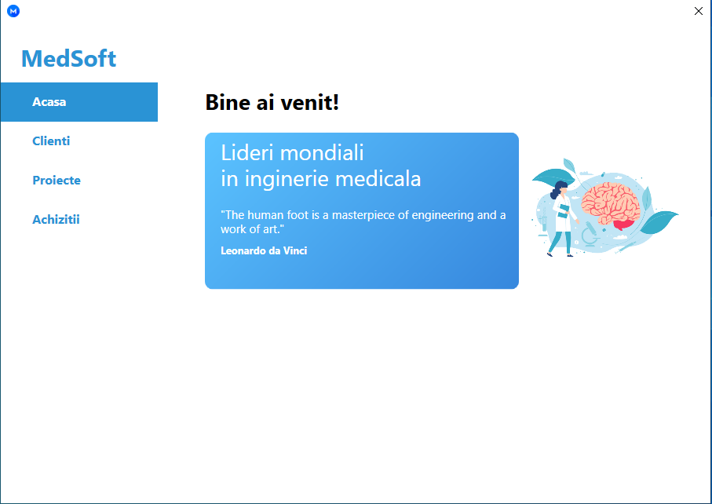

# medsoft_wpf_gui
This WPF (Windows Presentation Foundation) application is designed to assist medical facilities with tracking acquisitions and managing projects. It provides an intuitive graphical user interface (GUI) that helps healthcare professionals and administrative staff organize, monitor, and report various medical projects and acquisitions efficiently.

# MVVM Design Pattern
The application is built using the **MVVM (Model-View-ViewModel)** design pattern, which is a software architectural pattern that helps separate concerns in an application.

- **Model:** Represents the data and business logic of the application.
- **View:** The user interface (UI) that displays the data to the user.
- **ViewModel:** Acts as an intermediary between the Model and View, handling the presentation logic and binding data to the View.
This separation ensures a cleaner, more maintainable codebase, as well as making the UI easier to test and modify independently of the underlying data and logic.

Preview
Here’s a quick preview of the application interface:

